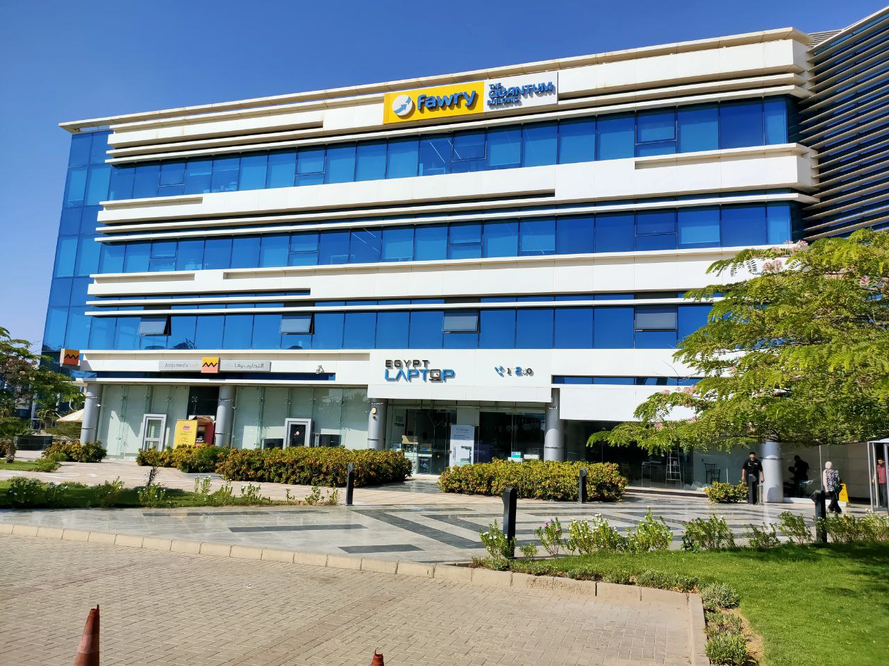

# Fawry-Internship

This repository contains materials and tasks for the Fawry internship program, This comprehensive program covers both frontend and backend development, equipping me with web technologies Spring and Angular and software engineering principles .

### The internship is onsite at the pretty new branch Quantum Building in Smart Village.

---

## Intern Content

### [First Week](./Week01/README.md) : OOP, Git Version Control, Collections, Java-8

#### Material

- [OOP](https://www.youtube.com/watch?v=FaaM6uVbuJM&list=PLCInYL3l2AagY7fFlhCrjpLiIFybW3yQv&pp=iAQB)
- [Git-Version-Control](https://youtu.be/Q6G-J54vgKc?si=mPa_ty8SLz_CqrN0)
- [Collections](https://www.javatpoint.com/collections-in-java)
- [Java-8](https://www.geeksforgeeks.org/java-8-features/)

> [!NOTE]
> It will be updated weekly, stay tuned . . .
